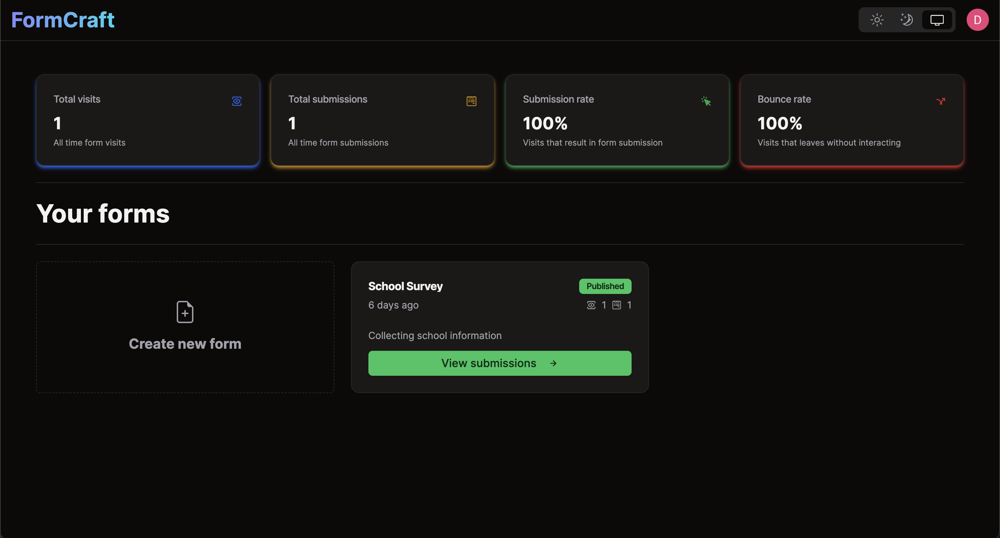

# FormCraft

## About the Project

FormCraft is a comprehensive platform designed to streamline the process of creating and sharing forms for data collection. Inspired by platforms like Google Forms, the Form Builder App offers a seamless experience for users to design forms, share them, and analyze the collected data.

## Tech Stack

- **Frontend**: Next.js, TypeScript, Tailwind CSS, Shadcn
- **Backend**: Prisma as ORM

## Features

- **Form Creation**: Users start by dragging and dropping form fields into the builder and customizing them.
- **Form Preview and Publishing**: Users preview the form to ensure it meets their requirements and then save and publish it to get a shareable link.
- **Form Sharing and Submission**: The shareable link is distributed, and respondents fill out and submit the form.
- **Analytics and Management**: Users access the analytics dashboard to monitor form performance and view detailed submission data.

## Live Demo

Check out the live demo: [FormCraft](https://form-builder-nine-hazel.vercel.app/)
